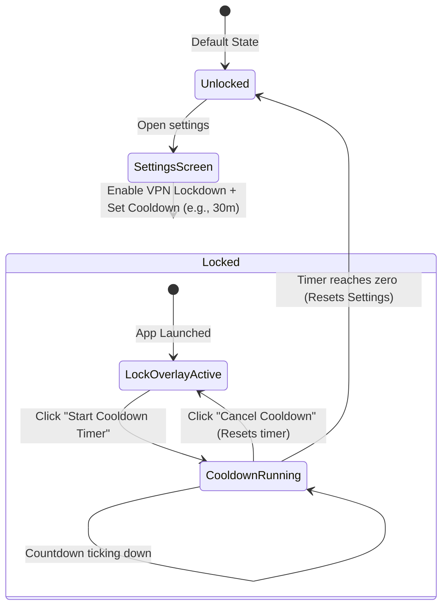

# BlockAds Feature Specification: VPN Timer Lock (Lockdown Mode)

This document specifies the technical design, workflow, code changes, and edge-case handling for the **VPN Lockdown Mode & Cooldown Timer** feature.

---

## 🎯 Feature Overview & Motivation

For users dealing with digital addictions (such as gambling, social media, shopping, or adult content), the standard ad-blocker suffers from an architectural limitation: **the user can easily turn it off during a moment of weakness.** In a split second, an impulsive urge can lead the user to open settings, whitelist a domain, or disable the VPN entirely, bypassing their own self-imposed protection.

The **VPN Timer Lock (Lockdown Mode)** introduces **cognitive friction** to interrupt this immediate feedback/reward loop. By locking down settings and disabling direct shutdown switches, the app forces a delayed cooling-off period. To disable the protection, the user must initiate a countdown (e.g., 30 minutes). During this time, they cannot browse blocked sites, but they are given time to cool down, self-reflect, and ideally let the superficial urge pass.

---

## 🔄 User Experience (UX) Flow



1. **Enabling Lockdown**:
   - The user opens [`SettingsScreen.kt`](file:///home/lucky/Development/blockads-android/app/src/main/java/app/pwhs/blockads/ui/settings/SettingsScreen.kt) and navigates to the new **Impulse Control & Lockdown** section.
   - They toggle **VPN Lockdown** ON and select a **Cooldown Timer Duration** from the options: `1m, 5m, 10m, 30m, 1h, 6h, 12h, 24h`.
   - Upon enabling, the VPN service is immediately started (if off) and the app goes into **Lockdown Mode**.

2. **Locked State Operations**:
   - The user **cannot** toggle the VPN switch OFF. Clicking the dashboard power toggle, app widgets, Tasker commands, or Quick Settings tiles is intercepted and ignored.
   - When the user opens the BlockAds app, a full-screen **Lockdown Overlay** blocks the rest of the application (excluding Splash & Onboarding). They cannot view or modify filter lists, whitelist apps, change DNS providers, or access settings.
   - The overlay displays a prominent message: *"BlockAds is locked. To modify your settings or disable ad blocking, you must initiate the cooldown timer."*

3. **Timer Unlocking Flow**:
   - The user clicks **"Start Cooldown Timer"** on the Lockdown Overlay.
   - A timer begins counting down from their chosen duration (e.g., 30:00, 29:59...).
   - **Important**: At any point during the countdown, the user has a **"Cancel Cooldown"** button. If clicked, the timer is immediately aborted, resetting the countdown back to the full duration and returning the app to the initial locked state.
   - If the timer completes successfully (reaches zero), the lockdown state is deactivated. The app reverts to the standard **Unlocked** state, allowing modifications or VPN toggle control.

---

## 🛠️ Technical Design & Code Mapping

To ensure a foolproof lockdown, we must intercept VPN shutdown actions across all entry points and enforce the lockout screen overlay.

### 1. Data Layer Configuration
We introduce three state variables in [`AppPreferences.kt`](file:///home/lucky/Development/blockads-android/app/src/main/java/app/pwhs/blockads/data/datastore/AppPreferences.kt):

```kotlin
// AppPreferences.kt additions
val lockdownEnabled: Flow<Boolean> = dataStore.data.map { it[LOCKDOWN_ENABLED] ?: false }
val lockdownDuration: Flow<Long> = dataStore.data.map { it[LOCKDOWN_DURATION] ?: 300000L } // default 5 minutes
val cooldownStartTimestamp: Flow<Long> = dataStore.data.map { it[COOLDOWN_START_TIMESTAMP] ?: 0L }

suspend fun setLockdownEnabled(enabled: Boolean) {
    dataStore.edit { it[LOCKDOWN_ENABLED] = enabled }
}
suspend fun setLockdownDuration(ms: Long) {
    dataStore.edit { it[LOCKDOWN_DURATION] = ms }
}
suspend fun setCooldownStartTimestamp(timestamp: Long) {
    dataStore.edit { it[COOLDOWN_START_TIMESTAMP] = timestamp }
}
```

### 2. Lockout UI Overlay (Compose root)
To prevent the user from accessing setting views, we overlay a Compose layout at the root container [`BlockAdsApp.kt`](file:///home/lucky/Development/blockads-android/app/src/main/java/app/pwhs/blockads/ui/BlockAdsApp.kt).

```kotlin
// BlockAdsApp.kt UI layout composition
@Composable
fun BlockAdsApp(...) {
    val appPrefs: AppPreferences = koinInject()
    val isLocked by appPrefs.lockdownEnabled.collectAsState(initial = false)
    val cooldownStart by appPrefs.cooldownStartTimestamp.collectAsState(initial = 0L)
    val duration by appPrefs.lockdownDuration.collectAsState(initial = 300000L)

    Box(modifier = Modifier.fillMaxSize()) {
        // Main App Navigation
        NavDisplay(backStack = backStack, ...)

        // Root Lockdown Overlay
        if (isLocked) {
            LockdownScreen(
                cooldownStart = cooldownStart,
                duration = duration,
                onStartCooldown = { timestamp ->
                    coroutineScope.launch { appPrefs.setCooldownStartTimestamp(timestamp) }
                },
                onCancelCooldown = {
                    coroutineScope.launch { appPrefs.setCooldownStartTimestamp(0L) }
                },
                onUnlockComplete = {
                    coroutineScope.launch {
                        appPrefs.setLockdownEnabled(false)
                        appPrefs.setCooldownStartTimestamp(0L)
                    }
                }
            )
        }
    }
}
```

#### LockdownScreen Ticker Logic
Inside `LockdownScreen`, a timer checks the duration dynamically:
```kotlin
@Composable
fun LockdownScreen(
    cooldownStart: Long,
    duration: Long,
    onStartCooldown: (Long) -> Unit,
    onCancelCooldown: () -> Unit,
    onUnlockComplete: () -> Unit
) {
    var currentTime by remember { mutableStateOf(System.currentTimeMillis()) }
    
    // LaunchedEffect ticker running every 1 second
    LaunchedEffect(cooldownStart) {
        if (cooldownStart > 0L) {
            while (true) {
                currentTime = System.currentTimeMillis()
                val elapsed = currentTime - cooldownStart
                if (elapsed >= duration) {
                    onUnlockComplete()
                    break
                }
                delay(1000L)
            }
        }
    }
    
    // Calculate remaining seconds
    val remainingMs = if (cooldownStart > 0L) duration - (currentTime - cooldownStart) else duration
    val secondsLeft = (remainingMs / 1000).coerceAtLeast(0)

    // Render lockdown UI, warnings, lock icons, progress bar, and trigger buttons...
}
```

### 3. Service Lifecycle Guarding (Failsafe)
We prevent external or programmatic stop commands inside [`AdBlockVpnService.kt`](file:///home/lucky/Development/blockads-android/app/src/main/java/app/pwhs/blockads/service/AdBlockVpnService.kt) and [`RootProxyService.kt`](file:///home/lucky/Development/blockads-android/app/src/main/java/app/pwhs/blockads/service/RootProxyService.kt):

```kotlin
// Inside AdBlockVpnService.onStartCommand / stopVpn checks
override fun onStartCommand(intent: Intent?, flags: Int, startId: Int): Int {
    if (intent?.action == ACTION_STOP) {
        val isLocked = runBlocking { appPrefs.lockdownEnabled.first() }
        if (isLocked) {
            Timber.w("Stop request ignored: VPN is in Lockdown Mode.")
            return START_STICKY
        }
    }
    // standard command routing...
}
```

Similarly, in [`ServiceController.kt`](file:///home/lucky/Development/blockads-android/app/src/main/java/app/pwhs/blockads/service/ServiceController.kt), prevent calling stop functions if lockdown is active.

### 4. Integration Broadcasts & Interceptors
We intercept requests from remote widgets, Tasker, and tiles:
- **Quick Settings Tile ([`AdBlockTileService.kt`](file:///home/lucky/Development/blockads-android/app/src/main/java/app/pwhs/blockads/service/AdBlockTileService.kt))**:
  Check `lockdownEnabled` snapshot inside `onClick()`. If locked, block state changes, keep tile `Tile.STATE_ACTIVE`, and dispatch a system status notification stating: *"BlockAds VPN is locked. Open the app to begin the unlock cooldown."*
- **App Widgets ([`WidgetToggleReceiver.kt`](file:///home/lucky/Development/blockads-android/app/src/main/java/app/pwhs/blockads/widget/WidgetToggleReceiver.kt))**:
  Inside `toggleVpn`, check lockdown preferences. If locked, abort stop, trigger a status notification, and send update broadcasts to keep the widget UI showing active.
- **Tasker Automation ([`TaskerReceiver.kt`](file:///home/lucky/Development/blockads-android/app/src/main/java/app/pwhs/blockads/receiver/TaskerReceiver.kt))**:
  Check lockdown status when receiving `ACTION_STOP`. Ignore the broadcast to maintain active filtering.

---

## 🛡️ Edge Cases & Handling Mitigations

### 1. Clock Manipulation (Time Tampering)
*Scenario*: The user starts a 12-hour cooldown timer and then shifts the Android system calendar clock forward 12 hours to force completion.

*Mitigations*:
- **Monotonic Boot Reference**: When a cooldown starts, save the monotonic system time (`SystemClock.elapsedRealtime()`) and the startup epoch. While the app is active, compute elapsed time using `SystemClock.elapsedRealtime()`.
- **Clock Regress Detection**: Periodically persist `lastActiveTimestamp = System.currentTimeMillis()`. If the app launches and the current system time is *earlier* than `lastActiveTimestamp`, time-tampering is detected.
- **Time Jump Detection**: If the difference between subsequent ticks is significantly larger than the delay duration (e.g., a jump of >10 minutes in 1 second), flag time-tampering.
- **Penalty Logic**: Upon detecting time tampering, freeze the countdown timer, reset `cooldownStartTimestamp = 0L` to stop the cooldown, and notify the user that the timer has reset due to time tampering.

### 2. Device Reboots
*Scenario*: The user restarts the device to clean volatile states or break loop checking.

*Mitigations*:
- **Boot Persistence**: The `cooldownStartTimestamp` is stored in the persistent `DataStore` preferences. Reboots do not clear it.
- **System Boot Override ([`BootReceiver.kt`](file:///home/lucky/Development/blockads-android/app/src/main/java/app/pwhs/blockads/service/BootReceiver.kt))**:
  Inside `onReceive`, if `lockdownEnabled` is true, immediately start the filtering VPN service, bypass the `autoReconnect` and `wasEnabled` flags, and enforce the VPN boot sequence.
- **Handling monotonic reset**: Since `SystemClock.elapsedRealtime()` resets to zero on boot, detect if the monotonic reference is lost (boot time has reset) and fall back safely to `System.currentTimeMillis()` for calculation, but re-calculate constraints.

### 3. Settings Bypass via Back Press / Gestures
*Scenario*: The user attempts to dismiss the Lockout screen via back navigation or system gestures.

*Mitigations*:
- The overlay layout uses Compose `BackHandler` which overrides back presses while lockdown is active:
  ```kotlin
  BackHandler(enabled = isLocked) {
      // Do nothing, consuming the back press action entirely
  }
  ```
- Because the overlay is declared outside the navigation stacks inside the root layout in [`BlockAdsApp.kt`](file:///home/lucky/Development/blockads-android/app/src/main/java/app/pwhs/blockads/ui/BlockAdsApp.kt), Android routing keys cannot swap or transition it away.

### 4. TV Platform Limitations
*Scenario*: How does the TV Companion App handle the lock?

*Mitigations*:
- The lock feature is primarily targeted toward mobile devices where personal digital addictions are most prevalent. 
- In the TV app ([`blockadstv`](file:///home/lucky/Development/blockads-android/blockadstv)), we can either synchronize preferences via accounts (if a shared cloud DB exists) or keep the TV app unlocked since system settings access on TV devices is rare and remote navigation is tedious. Mobile-only configuration is recommended for the initial implementation phase.

---

## 📈 Standard Sandbox Limitations vs. Enterprise Enforcement

In a standard Android sandboxed environment, a regular application is constrained by the OS security model. Without administrative privileges, the following bypass actions cannot be fully prevented at the system level:

1. **System VPN Revocation**: The user can navigate to *Settings -> Network -> VPN* and toggle the VPN off or remove the profile.
2. **Force Stopping the App**: The user can open *Settings -> Apps -> BlockAds* and click **Force Stop**, halting all background processes.
3. **App Uninstallation**: The user can uninstall BlockAds, removing all constraints.

While the standard **Lockdown Mode** relies on cognitive friction (adding steps to interrupt impulsive urges), advanced users or individuals experiencing strong urges can bypass it by performing these OS-level actions.

To address these vulnerabilities and offer an **unbreakable impulse control mechanism**, BlockAds can be configured in **Android Device Owner (DO) Mode**. This leverages Android Enterprise APIs to enforce system-level compliance, effectively blocking the standard bypass vectors.

---

## 🏢 Android Device Owner (DO) Mode: Unbreakable Impulse Control

Android Device Owner (DO) mode allows BlockAds to act as the device's **Device Policy Controller (DPC)**. By enrolling the app with elevated administrative privileges, we can call privileged APIs under `DevicePolicyManager` to lock down the operating system itself.

### 🤫 Hidden Activation & Auto-Enforcement Design
To prevent average users from being confused or accidentally lock-in their settings, DO Mode is designed as a **hidden, auto-enforcing state**:
1. **Zero UI Triggers for Regular Users**: There is no toggle or settings entry to "Enable Device Owner" in standard mode.
2. **Auto-Enforcement on Boot**: On app startup, BlockAds queries the system (`DevicePolicyManager.isDeviceOwnerApp()`). If provisioned as Device Owner, it immediately and automatically applies all restrictions. If not provisioned, it falls back to standard sandbox mode with absolutely no visual differences or changes to the user interface.
3. **Guarded Settings Visibility**: The UI elements to manage DO state are dynamically exposed **only** if the app is already installed as Device Owner. These elements include:
   - **Clear/Suspend Restrictions**: Temporarily lifts system restrictions (e.g. Always-on VPN, debugging block).
   *Crucial Guardrail*: This administrative command is only clickable when the cooldown timer has elapsed and the app is in the **Unlocked** state. Note: there is no deprovisioning setting; an advanced user that can install the app as DO should be able to uninstall it if they want to.

---

### 🔄 Mitigation Matrix: Resolving standard bypasses

| Bypass Action | Standard Behavior | Device Owner Mode Protection | Android API Used |
| :--- | :--- | :--- | :--- |
| **System VPN Revocation** | User toggles off VPN or deletes profile in System Settings. | Enforces Always-on VPN. Settings gear and toggle are disabled. | `setAlwaysOnVpnPackage(admin, packageName, lockdownEnabled = false)` & `addUserRestriction(admin, UserManager.DISALLOW_CONFIG_VPN)` |
| **Force Stopping the App** | User clicks "Force Stop" in app settings. | System grays out/disables the **Force Stop** button. User cannot terminate background VPN or UI processes. | Automatic OS behavior for active DPCs. Can be combined with `addUserRestriction(admin, UserManager.DISALLOW_APPS_CONTROL)`. |
| **App Uninstallation** | User uninstalls BlockAds. | System grays out the **Uninstall** button in settings and disables launcher drag-to-uninstall actions. | `setUninstallBlocked(admin, packageName, true)` |
| **Settings / Cache Wiping** | User clicks "Clear Storage" or "Clear Cache" in settings. | Disables modification of application settings, preventing data wipes that would reset the cooldown state. | `addUserRestriction(admin, UserManager.DISALLOW_APPS_CONTROL)` |

---

### 🛠️ Proposed Architecture & Code Integration

Integrating Device Owner capabilities requires minimal overhead because it utilizes built-in Android system framework classes, but it requires strict lifecycle guarding.

```mermaid
graph TD
    Startup[App Startup / Service Boot] -->|Check Device Owner Status| DPM_Check{isDeviceOwnerApp?}
    DPM_Check -->|Yes| EnforcePolicies[Automatically Apply DPM restrictions]
    DPM_Check -->|No| NormalMode[Run in Standard Sandbox Mode]
    
    subgraph UI Settings Integration (Only Visible if Device Owner)
        DO_UIVisible[Render DO Settings section] --> ClearRest[Clear Restrictions Button]
        ClearRest -->|Only in Unlocked State| RunClear[Suspend restrictions]
    end
    
    subgraph System Restrictions
        EnforcePolicies -->|1. Lock VPN| AlwaysOn[Always-on VPN + Lockdown]
        EnforcePolicies -->|2. Lock Package| UninstallBlocked[setUninstallBlocked = true]
        EnforcePolicies -->|3. Disallow Settings| RestrictVPN[DISALLOW_CONFIG_VPN + DISALLOW_APPS_CONTROL]
        EnforcePolicies -->|4. Close ADB Bypass| RestrictDebug[DISALLOW_DEBUGGING_FEATURES]
    end
```

#### 1. Component Registration: `AdBlockDeviceAdminReceiver`
To receive device management lifecycle events, we must register a `DeviceAdminReceiver`.

- **Class Definition** ([`AdBlockDeviceAdminReceiver.kt`](file:///home/lucky/Development/blockads-android/app/src/main/java/app/pwhs/blockads/service/AdBlockDeviceAdminReceiver.kt)):
  ```kotlin
  package app.pwhs.blockads.service

  import android.app.admin.DeviceAdminReceiver
  import android.content.Context
  import android.content.Intent
  import timber.log.Timber

  class AdBlockDeviceAdminReceiver : DeviceAdminReceiver() {
      override fun onEnabled(context: Context, intent: Intent) {
          super.onEnabled(context, intent)
          Timber.i("BlockAds Device Admin enabled.")
      }

      override fun onDisabled(context: Context, intent: Intent) {
          super.onDisabled(context, intent)
          Timber.w("BlockAds Device Admin disabled.")
      }
  }
  ```

- **Policy Metadata** ([`device_admin_policies.xml`](file:///home/lucky/Development/blockads-android/app/src/main/res/xml/device_admin_policies.xml)):
  ```xml
  <?xml version="1.0" encoding="utf-8"?>
  <device-admin xmlns:android="http://schemas.android.com/apk/res/android">
      <uses-policies>
          <!-- Declares that the admin receiver is used for device-owner enterprise management -->
      </uses-policies>
  </device-admin>
  ```

- **Manifest Registration** ([`AndroidManifest.xml`](file:///home/lucky/Development/blockads-android/app/src/main/AndroidManifest.xml)):
  ```xml
  <receiver
      android:name=".service.AdBlockDeviceAdminReceiver"
      android:label="@string/app_name"
      android:description="@string/device_admin_description"
      android:permission="android.permission.BIND_DEVICE_ADMIN"
      android:exported="true">
      <meta-data
          android:name="android.app.device_admin"
          android:resource="@xml/device_admin_policies" />
      <intent-filter>
          <action android:name="android.app.action.DEVICE_ADMIN_ENABLED" />
      </intent-filter>
  </receiver>
  ```

#### 2. Policy Enforcer Service: `DeviceOwnerManager`
We expose a manager class to handle programmatic applying and clearing of policies based on the application state.

```kotlin
class DeviceOwnerManager(
    private val context: Context,
    private val appPrefs: AppPreferences
) {
    private val dpm = context.getSystemService(Context.DEVICE_POLICY_SERVICE) as DevicePolicyManager
    private val adminComponent = ComponentName(context, AdBlockDeviceAdminReceiver::class.java)

    /**
     * Checks if the app is currently provisioned as the Device Owner.
     */
    fun isDeviceOwner(): Boolean {
        return dpm.isDeviceOwnerApp(context.packageName)
    }

    /**
     * Applies system restrictions. This is triggered when the app starts.
     */
    fun enforceRestrictions() {
        if (!isDeviceOwner()) return
        
        try {
            // 1. Prevent app uninstallation
            dpm.setUninstallBlocked(adminComponent, context.packageName, true)

            // 2. Force always-on VPN connection with lockdown (blocks traffic when disconnected)
            dpm.setAlwaysOnVpnPackage(adminComponent, context.packageName, false)

            // 3. Block user access to VPN configurations
            dpm.addUserRestriction(adminComponent, UserManager.DISALLOW_CONFIG_VPN)

            // 4. Disable USB debugging and Developer options to close the ADB bypass vector
            dpm.addUserRestriction(adminComponent, UserManager.DISALLOW_DEBUGGING_FEATURES)

            // 5. Block modifying applications (clearing cache/data or force-stopping other apps)
            dpm.addUserRestriction(adminComponent, UserManager.DISALLOW_APPS_CONTROL)

            Timber.i("Device Owner restrictions successfully applied.")
        } catch (e: Exception) {
            Timber.e(e, "Failed to apply Device Owner restrictions")
        }
    }

    /**
     * Clears restrictions. This can ONLY be called when the cooldown timer has completed 
     * and the app is in the 'Unlocked' state.
     */
    fun clearRestrictions() {
        if (!isDeviceOwner()) return

        try {
            dpm.setUninstallBlocked(adminComponent, context.packageName, false)
            dpm.setAlwaysOnVpnPackage(adminComponent, null, false)
            dpm.clearUserRestriction(adminComponent, UserManager.DISALLOW_CONFIG_VPN)
            dpm.clearUserRestriction(adminComponent, UserManager.DISALLOW_DEBUGGING_FEATURES)
            dpm.clearUserRestriction(adminComponent, UserManager.DISALLOW_APPS_CONTROL)
            
            Timber.i("Device Owner restrictions cleared.")
        } catch (e: Exception) {
            Timber.e(e, "Failed to clear Device Owner restrictions")
        }
    }

}
```

---

### 🔍 Threat Model, Edge Cases & Meticulous Vulnerability Analysis

A state-of-the-art protection system must anticipate malicious self-tampering by a user under the influence of strong impulses. Below is an exhaustive breakdown of potential attack vectors and their corresponding mitigations.

#### 1. The USB Debugging / ADB Bypass
- **Vulnerability**: A user with programming experience can connect their phone to a computer and run `adb shell pm uninstall app.pwhs.blockads` or `adb shell pm disable-user app.pwhs.blockads`.
- **Mitigation**: When DO mode is active, the app applies `UserManager.DISALLOW_DEBUGGING_FEATURES`. This disables Android Developer Options and shuts down USB Debugging instantly. If the user tries to go to developer options, the screen is grayed out with a message: *"This setting is disabled by your administrator."*
- **Edge Case**: If USB debugging was *already* active and a debug session is currently running while the policy is toggled on, the current ADB connection might persist until unplugged.
- **Mitigation**: The app should prompt the user to unplug the cable before locking down, and verify that `dpm.addUserRestriction` has fully closed active debug connections.

#### 2. The Safe Mode Escape Hatch
- **Vulnerability**: If the user powers off the phone, holds down the physical volume keys during boot, and enters **Safe Mode**, Android disables all third-party services and applications. In Safe Mode, the BlockAds VPN is inactive, allowing unrestricted internet access.
- **Mitigation**: 
  - Standard Android APIs do not support disabling Safe Mode. However, on specific OEM enterprise-managed devices (e.g., Samsung Knox, Zebra, Honeywell), DPC apps can disable Safe Mode entirely using OEM SDK extensions.
  - On standard Android, booting into Safe Mode cannot be blocked. However, this action requires a full hardware reboot. Re-starting the device creates a significant cognitive barrier and delay, which aligns with the core goal of the cooldown timer (adding friction). Once the user reboots out of Safe Mode, BlockAds immediately restarts via `BootReceiver` and re-applies the system restrictions, maintaining the lockdown integrity.

#### 3. Hardware Recovery Partition / Factory Reset
- **Vulnerability**: The user triggers a **Factory Data Reset** (either via system settings or physical recovery buttons) to wipe the device and remove the Device Owner profile.
- **Design Decision (No Restriction)**:
  - In alignment with user control guidelines, the app **does not** apply `UserManager.DISALLOW_FACTORY_RESET`. Allowing factory resets is an essential user safety feature and ensures that the user maintains ultimate hardware ownership.
  - Furthermore, a factory reset requires the user to wipe all local personal data (photos, messages, accounts). This extreme penalty creates a massive barrier (friction), which successfully deters impulsive bypassing while preserving the user's right to reset their device in an emergency.

#### 4. The De-provisioning Policy Loophole
- **Vulnerability**: DPC applications cannot be removed by the user in settings, but they *can* be de-provisioned programmatically inside the app using `dpm.clearDeviceOwnerApp()`. If the user finds a way to trigger this method during the lockdown period, the protection is neutralized.
- **Mitigation**: 
  - The app intentionally omits a deprovisioning feature. If an advanced user needs to remove the app, they can uninstall it using standard ADB commands, eliminating the risk of a programmatic UI bypass.
  - The preference logic and database entries for the cooldown duration must reside in a secure, encrypted database space or protected `DataStore` that is read-only when the lockdown screen is active.

#### 5. Work Profile Limitations
- **Vulnerability**: If BlockAds is provisioned as a **Profile Owner (PO)** of a Work Profile instead of a **Device Owner (DO)**:
  - The restrictions (Always-on VPN, uninstall block) will only apply to applications running *inside* the Work Profile container.
  - Applications in the Personal Profile will remain unaffected, rendering the VPN block useless for personal apps.
- **Mitigation**: The settings UI must explicitly check `dpm.isDeviceOwnerApp()` and *not* `dpm.isProfileOwnerApp()`. It must warn the user that Profile Owner mode is insufficient and that full Device Owner provisioning is mandatory for system-wide protection.

---

### 🚀 Device Provisioning & Setup Workflows

Because Android enforces strict security boundaries around Device Owner designation, a standard APK installation cannot request DO privileges. Users must enroll the device using one of the following methods:

#### Method 1: ADB Command (Post-Install, Account-Free)
Ideal for advanced users who do not want to wipe their device, but requires temporary removal of all accounts:
1. Remove all Google, email, and social accounts from *Settings -> Accounts*.
2. Enable USB Debugging in Developer Options.
3. Install the BlockAds APK.
4. Connect the phone to a computer and execute:
   ```bash
   adb shell dpm set-device-owner app.pwhs.blockads/app.pwhs.blockads.service.AdBlockDeviceAdminReceiver
   ```
5. Re-add system accounts. The app is now provisioned as Device Owner.

#### Method 2: QR Code Provisioning (On Factory Reset)
Best for fresh device installations:
1. Factory reset the device.
2. At the initial "Welcome" screen, tap the screen background 6 times in the exact same spot.
3. This triggers the hidden camera scanner. Scan a QR code containing the following provisioning payload:
   ```json
   {
     "android.app.extra.PROVISIONING_DEVICE_ADMIN_COMPONENT_NAME": "app.pwhs.blockads/app.pwhs.blockads.service.AdBlockDeviceAdminReceiver",
     "android.app.extra.PROVISIONING_DEVICE_ADMIN_PACKAGE_DOWNLOAD_LOCATION": "https://github.com/TaqiHamoda/blockads-android/releases/download/latest/blockads.apk",
     "android.app.extra.PROVISIONING_LEAVE_ALL_SYSTEM_APPS_ENABLED": true
   }
   ```
4. The system will download the APK, install it, and launch setup with Device Owner mode automatically configured.

